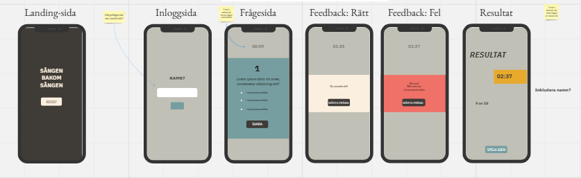
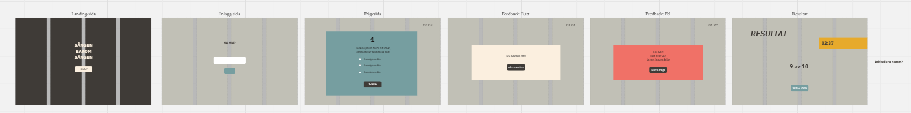
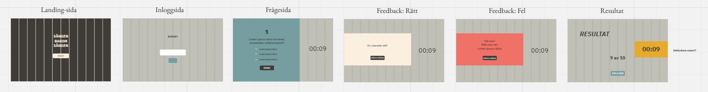

# Sången bakom sången

## Demolink

https://medieinstitutet.github.io/fed23d-javascript-grundkurs-gruppuppgift-apelsinerna/

## Assignment introduction

An introduction to our first attempt at navigating TypeScript (send help). And and why not combine it with our first ever collaborative group assigment (hello code conflict) whilst exploring the world of TypeScript. Oh and whilst we are at it we might as well throw the concept of agile workflows into the mix.

What you see is a joint collaborative effort between five authors resulting in a minimalist quiz that serves its purpose. Unfortunately for all you non-Swedish speakers, you won't get to experience how little you actually know about real music.

## Authors

- [@alahojat](https://www.github.com/alahojat)
- [@MustafaaMehdi](https://github.com/MustafaaMehdi)
- [@olandstorm](https://github.com/olandstorm)
- [@LilithSWE](https://github.com/LilithSWE)
- [@PerRosen63](https://github.com/PerRosen63)

## Built with

       

## Initial Wireframes

Mobile Tablet  Desktop 

## Result

Text text text

## Lessons Learned

As mentioned earlier this assignment was a group collaborative project which required us to get familiar with planning and structure, coding together and merging our code to produce a quiz. The quiz in itself requires the following:

- 10 questions with 3 answer options, only 1 answer can be right
- when the first initial round is played the user can retake the quiz, however must be presented with a new set of questions.
- whilst the quiz is running a timer is ticking
-

General takeaways:

Throughout this project we have collectively and individiually acquired a lot of takeaways and lessons learned.

- We have learned how to navigate the world of GitHub, the importance of spending an adequate amount of time planning and structuring a project before venturing out into writing code.
- We have learnt how to implement agile workflows into group projects, the importance of communication and the ability to read and understand each others code. In hindsight we are also grateful that we all kept our cool throughout the process, which enabled us to truly embrace the project.

TypeScript specific takeaways:

- We have also appreciated the advantages of being able to use TypeScript to define variables, various types as well as interfaces to eliminate usererrors and programming errors, which has been beneficial especially in a group setting.
- It has also been benecifical to receive errormessages as you go, which reduces potential bugs further along the project.
- Furthemore it has been useful to find a mutual way of coding

## Validation reports

[HTML validation](https://linktodocumentation)

[CSS validation](https://linktodocumentation)

[Lighthouse report](https://linktodocumentation)

## Acknowledgements

[many thank you's to our mastermind teacher](https://github.com/postmodernistx)
